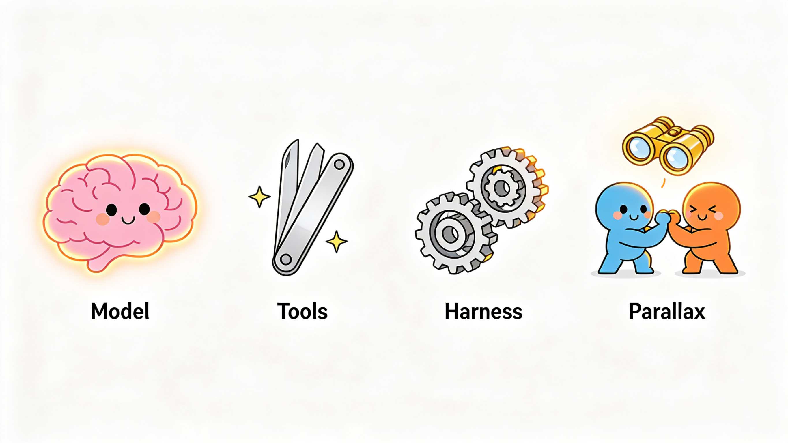
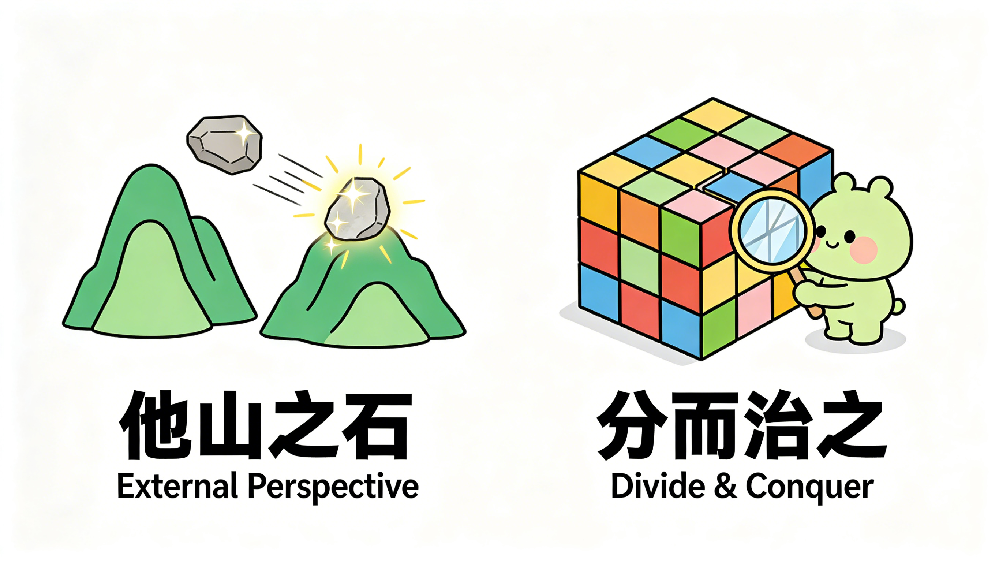
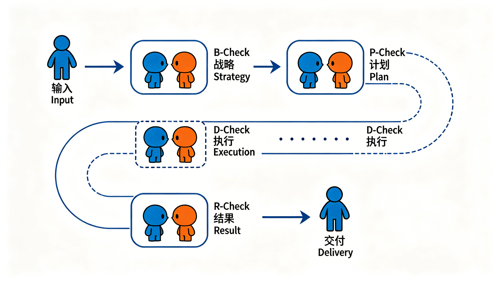

# Parallax Is All You Need?

[](https://github.com/AI4MSE/Parallax)

**他山之石，可以攻玉：如何让你的 AI Agent 更加可靠**

[English Version →](README.md)

---

> AI Agent 自己写完自己检查，就像学生批改自己的作业——永远觉得都对。

**Parallax**——直译"视差"，即从不同角度看同一个东西时产生的位置偏移（源自希腊语 *parallaxis*：para- 旁边 + allassein 改变）**是一个很简单的道理：先拆开，再找外人看。每一块都找外人看。**

想马上用起来？直接跳到 → [**马上试试**](#马上试试)
想了解为什么？继续往下读。

---

## Agent 架构的第四个维度



**Model** 让 Agent 能思考。**Tools** 让它能行动。**Harness** 让它迭代跑向目标。

**Parallax 让它做得对。**

---

## 为什么需要 Parallax

### 有时好用，有时离谱

用过 AI 编程工具或 AI 助手的人，大概率有过这种体验：有时候它像开了挂，十分钟干完你一天的活；有时候它自信满满地给你一坨看起来很对、仔细一看全是坑的东西。你永远不知道这次拿到的是哪种。

更让人崩溃的是——你有了 AI 助手之后，反而**更累了**。你以为 AI 来帮你干活，结果你变成了它的全职监工：审查它的每一步，修正它的每一个错误，确认它没有跑偏。花在"检查 AI"上的时间，快赶上自己动手了。

这不是你的问题。是架构的问题。

### 自己审自己，审不出来

你肯定有过这种经历：写完一篇文章，反复读了三遍，觉得完美——发给朋友，人家第一眼就挑出了错别字。

AI 也是这样，而且更严重。

2024 年的一项研究在 AI 领域引起了不小的震动：**大语言模型在没有外部反馈的情况下，根本没法可靠地自我纠错** [1]。不仅纠不了，有时候越纠越错——它会把本来对的答案"修正"成错的。后续的大规模调研也确认了这一点 [2]。

反映在实际使用中：2025 年的一项评测显示，当时最强的模型跑超过 4 小时的任务，成功率不到 10% [3]。微软 2026 年的一项研究也发现，多个主流模型在自主执行文件处理等委托任务时，表现会出现退化 [4]。

任务越长越复杂，模型越容易在自己的逻辑里越陷越深——最可怕的是，它完全意识不到。

### 从日心说之争说起


天文学史上有一段持续了很久的争论：地球到底是不是宇宙的中心？

日心说——地球绕太阳转——其实很早就被提出了。但反对者有一个关键质疑：如果地球真的在动，我们从轨道这边看一颗星，半年后从另一边看，星的位置应该会有微小偏移（恒星视差）。可是谁也测不到这个偏移。

16 世纪最强的天文观测者第谷·布拉赫认真找了——找不到。于是他设计了一套自己的宇宙模型，在已有观测精度下和日心说的预测几乎无法区分，但地球不用动。数据完美支持，逻辑完美自洽。

**但他是错的。** 真正能分辨两者的信号——恒星视差——比他仪器的检测能力小了将近 200 倍。信号就在那儿，他永远看不到——因为他被**困在了自己的观测气泡里**。

直到 1838 年，Bessel 换了思路：从地球轨道两端——相隔 3 亿公里——看同一颗星，终于捕到了那个微小的偏移 [5]。

同一年，Wheatstone 在完全不同的领域发现了一模一样的道理：人能感知深度，是因为两只眼睛从不同位置看到了不同的画面 [6]。

**两个领域，同一年，同一个发现：深度来自不同位置的观测差异。一个观测点永远不够。**

教训很清楚：第谷不蠢，数据也没问题。**在同一个参考系内部，自洽的错误和自洽的真理看起来一模一样。只有引入外部观测点，才能分辨。**

### 回到 AI Agent

今天主流的 Agent 架构通常被描述为三层：**Model**（推理引擎）+ **Tools**（行动能力）+ **Harness**（执行脚手架：重试、状态管理、上下文维护、工具调度、流程编排）。这三层让 Agent 越来越强大。

很多人也已经在实践各种形式的"独立审查"——代码 review agent、多轮验证、独立测试。这些做法是有效的。

Parallax 是一个基于我们实践总结的初步体系，供大家参考。

苏轼在近一千年前就说透了：

> **横看成岭侧成峰，远近高低各不同。**
> **不识庐山真面目，只缘身在此山中。**

---

## Parallax 的两个核心洞见



### 他山之石，可以攻玉

这句话出自《诗经》，大约三千年前的中国人就总结出来了。朱熹的注解说得最透：

> **两玉相磨不可以成器，以石磨之，然后玉之为器，得以成焉。**

玉不能拿玉来磨——同种材料之间磨不出什么。你得找别的山上的石头，才能把玉雕成器。

翻译成 AI 的语言：**一个 Agent 不应该只靠自己审自己。** 每一次关键验证，都值得引入一个跟执行者无关的独立视角。在同一个上下文里做自我反思，往往就是拿玉磨玉——外表光滑，内里空洞。

机器学习里有个经典的理论模型描述了这件事。2014 年 Goodfellow 等人提出 GAN（生成对抗网络）[7]，打了个比方：

> 一边是伪钞制造者，一边是警察。造假的想以假乱真，查假的想把假钞挑出来。

**伪钞贩子独自工作的时候，没有动力精益求精。** 只有当警察介入，两者形成对抗，假钞的质量才会不断逼近真钞——因为不进步就会被抓。

AI Agent 也是这个道理。干活的全力往前冲（"怎么做"），审的独立往回拉（"对不对"），拉扯之间才逼近真相。当然，拉扯也不能没完没了——好的 Parallax 设计要在"充分质疑"和"高效收敛"之间找到平衡。

这个道理在中国古典智慧中反复出现，各种说法，同一个意思：

| 出处 | 原文 | 白话 |
|------|------|------|
| 《诗经》 | 他山之石，可以攻玉 | 外面的石头才能磨出好玉 |
| 苏轼 | 不识庐山真面目，只缘身在此山中 | 站在山里看不到山 |
| 《旧唐书》 | 当局者迷，旁观者清 | 下棋的不如看棋的 |
| 魏征 | 兼听则明，偏信则暗 | 多听才明白，偏信就糊涂 |
| 《孙子兵法》 | 知彼知己，百战不殆 | 光知道自己还不够 |

不同时代，不同人，同一个认识论结论：**认知的深度来自视角的差异。**

### 化整为零，分而治之

光有外部视角还不够。

想象一个审计师，面前堆着一家公司全年所有部门的财务流水——几十万条记录。再厉害的审计师也会迷失。但如果按月拆开、按部门分、按科目归类，每一块的审查就变得可控。

AI 面临的挑战更大。当前模型存在一些已知的结构性限制，包括但不限于：
- **上下文有限**：不可能把所有信息塞进一次对话
- **注意力稀释**：上下文越长，对细节的把握越差
- **角色容易串戏**：在同一个会话里同时当执行者和审查者，两种角色容易互相干扰

这些限制意味着，把复杂任务拆解开来不仅是"更好"，很多时候是"必须"。Parallax 建议至少从以下几个方向考虑拆解：

**时间上拆**：别等到最后才检查。动手前审计计划（B-Check），做完后对照结果（R-Check），过程中也持续校准。1976 年 IBM 的 Fagan 发现：细粒度代码检查能抓住 80-90% 的缺陷 [8]。检查的频率往往比单次检查的深度更重要。

**空间上拆**：执行者和验证者不能共享上下文和记忆。验证者一旦能看到执行者的全部思考过程，就不再是"旁观者"了——变成了"当局者"。"旁观者清"的前提是你真的站在旁边，不是坐在牌桌上。

**架构上拆**：战略和战术最好分家。"我们的目标是什么"和"这行代码该怎么改"放在同一个对话里讨论，容易互相干扰——战术细节的焦虑会模糊战略判断，战略的宏观模糊会让战术无从下手。

当然，拆解的维度远不止这些。不同场景下可能有不同的拆法，这里只是几个最常见的方向。

用一个更直觉的比方：这就像微积分。一条弯曲的曲线，你只在两头各量一个大矩形，误差能大到离谱。但如果切成很多小区间，每个都量一下，加起来就越来越接近真实面积。Parallax 也是一样——把长任务切成小段，每段都做独立视差校验，小误差就地清零，不给它滚成大雪球的机会。

### 两个洞见的关系

第一个洞见管"**谁来看**"——必须是外人。
第二个洞见管"**怎么看得清**"——必须拆开。

缺一个都不行：
- 有外人但不拆 = 面对一团浆糊，外人也看不清
- 拆了但没外人 = 每块还是自己审自己，白拆

**先拆开，再找外人看。每一块都找外人看。**

---

## 工程实践

说完道理，说实操。下面是 AI Agent 常见的几种翻车方式，以及 Parallax 怎么应对：

**方向搞错了。** AI 在自己的逻辑里自嗨，计划越做越偏，自己还觉得很有道理。→ **B-Check**：动手之前，让独立 Agent 审你的计划。源头就掐住。

**做多了或做少了。** 你让它做 A，它顺手把 BCD 也做了——或者只做了半个 A 就告诉你完事了。→ **R-Check**：做完之后，让独立 Agent 拿着你的原始需求逐条对。别信它说的"已完成"。

**信誓旦旦全是幻觉。** 它告诉你"没问题，我检查过了"——其实全是逻辑自洽的错误，报喜不报忧。→ **TDD 思维（红灯-绿灯）**：先写测试，跑一遍，确认它会失败（红灯），证明这个测试真的在检查东西。然后再写实现让它通过（绿灯）。如果跳过"先看到红灯"这一步，你的验收标准就是个橡皮图章，什么都能过。

**越跑越偏。** 一开始还挺靠谱，做着做着就跑飞了。→ **相位隔离**：把战略思考和战术执行放在不同的上下文里。看路的人不走路，走路的人不看路。

**有了 AI 反而更累。** 你变成了它的全职质检员，比自己干还费劲。→ **Parallax 自动化**：把"检查"也交给独立 Agent，串成自动化流水线。你只在关键决策点介入。

这些只是 Parallax 思想在特定场景下的体现，远不是全部。核心就一句话：**找一个站在不同位置的人帮你看一眼。** 具体怎么做，取决于你的场景。

这个思路并不是全新的。2018 年 Irving 等人就从 AI 安全角度提出过类似洞见：让两个 AI 辩论，人类做裁判——"撒谎比揭穿谎言更难" [9]。Parallax 尝试把这类洞见整合成一个可操作的工程框架。

---

## 走向自动化：Parallax Loop

上面说的这些，如果每次都要人来协调，那只是把"监工 AI"变成了"监工审查流程"——换汤不换药。

Parallax 真正的使用价值在于：**它可以编排成一个完整的自动化闭环。**



一个完整的 Parallax Loop 大致分为这几个阶段，每个阶段都有对应的独立审查：

```
人类输入需求/问题
  ↓
┌──────────────────────────────────────────┐
│  分析阶段                                 │
│  理解问题 → 调研根因 → 形成结论            │
│  → B-Check：独立审查分析是否靠谱           │
│  ↻ 不通过就打回重新分析                    │
└──────────────────┬───────────────────────┘
                   ↓
┌──────────────────────────────────────────┐
│  计划阶段                                 │
│  制定方案 → 拆解子任务 → 定义验收标准       │
│  → P-Check：独立审查计划是否合理            │
│  ↻ 不通过就打回重新规划                    │
└──────────────────┬───────────────────────┘
                   ↓
┌──────────────────────────────────────────┐
│  执行阶段（每个子任务，干净上下文）          │
│  执行 Agent → 完成子任务                   │
│  → D-Check：独立审查交付物是否符合计划       │
│  ↻ 不通过就打回重做                        │
└──────────────────┬───────────────────────┘
                   ↓
┌──────────────────────────────────────────┐
│  验收阶段                                 │
│  汇总所有子任务 → 端到端验证                │
│  → R-Check：独立对照最终产出与原始需求       │
└──────────────────┬───────────────────────┘
                   ↓
              最终交付 → 人类
```

每一步都遵循同一个原则：**干活的和检查的不是同一个人，上下文互相隔离。**

注意几个关键的实践要点：

- **每个阶段有自己的审查，不能混。** 审分析的时候不讨论实现，审计划的时候不回头改分析，审结果的时候不重新做计划。混在一起等于又回到了"一锅炖"。
- **每个子任务用干净的上下文。** 不管是启动一个新的 sub-agent、开一个新会话、还是其他等效的隔离方式——关键是执行者不带着上一个任务的"记忆残留"。上下文污染是长程任务漂移的主要来源之一。
- **战略和战术分开讨论。** "我们要解决什么问题"和"这行代码怎么改"不能放在同一个上下文里。混在一起，战略会被战术细节淹没，战术又因为战略模糊无从下手。

上面画的是一个基于 Parallax 的流程示范，实际使用中可以更加复杂，也可以大幅简化。简单任务可能只需要一个 B-Check 就够了；复杂的长程项目可以走完全流程甚至扩展更多环节。**Parallax 不是一刀切的规定，是一个可以灵活组装的框架。**

**不管你的场景是什么——写代码、做调研、写文章、管项目——只要把 Parallax 的两个核心洞见嵌进关键环节，你就在跑自己的 Parallax Loop。**

---

## 马上试试

看到这里，你可能想说："道理我都懂了，怎么上手？"

最快的方式：下载下面两个技能，导入你的 Agent 工作流，直接开跑。

**[B-Check](skills/bcheck/chs/SKILL.md)** —— 通用独立审查。不管是计划、方案、分析、代码还是文档——任何你觉得需要第二双眼睛看一看的东西，都可以丢给它。它的态度很凶，专挑你不想面对的问题。在完整的 Parallax Loop 里，分析阶段用 B-Check，计划阶段有专门的 P-Check（更侧重方案可行性和拆解合理性）；单独用的话，B-Check 就是一个通用的"找外人看一眼"工具。

**[R-Check](skills/rcheck/chs/SKILL.md)** —— 事后结果验证。做完之后，让一个独立 Agent 拿你的原始需求逐条对照产出。它不管你过程多辛苦，只看结果对不对。

这两个技能只是 Parallax 的起点。正如上面 Parallax Loop 流程图所示，完整的体系覆盖从分析、计划、执行到验收的每一个阶段——B-Check（事前审查）、P-Check（计划审查）、D-Check（交付审查）、R-Check（结果验收）等等<sup>[*](#xcheck)</sup>。B-Check 和 R-Check 是其中最通用、最容易上手的两块积木，你可以用它们搭出属于自己的 Parallax Loop。

<a name="xcheck"></a>
> **\* 关于 X-Check：** 上面提到的 B-Check、P-Check、D-Check、R-Check 等，在实现上不一定是完全不同的技能——它们可能共享同一套核心审查机制，只是针对不同阶段调整了 prompt 和关注点。你也完全可以不用独立技能来实现，而是通过 Agent 之间的通信协议（如 MCP、A2A 等）让 Agent 在协作过程中自然地完成互相审查。Parallax 定义的是"什么时候需要独立视角"和"视角之间怎么隔离"，具体用什么技术手段来实现，取决于你的架构。

几个使用上的建议：

- **打分和轮次限制。** 每一轮审查可以设置一个打分体系（比如 1-5 分），达到阈值才通过，同时设定最大轮次（比如 3 轮）防止无限循环。这其实和 GAN 的思路一样——对抗要收敛，不能没完没了。具体的评分标准可以根据你的场景自己定，我们在技能里提供了一些参考。
- **尽量用不同家族的模型做审查。** 如果执行用的是 A 模型，审查尽量用 B 模型——不同的训练数据和偏好会产生更大的认知视差。当然，即使用同一家族的模型，只要在审查 prompt 里加入明确的"反趋同声明"（anti-sycophancy statement），实践中效果也不错。关键是角色和目标的分离，不只是模型的分离。
- **TDD 思维：先看到失败，再看到成功。** 这是软件工程里一个经典但常被忽略的智慧——先写测试，跑一遍确认它会失败（证明测试是有效的），然后再写实现让它通过。对 AI Agent 也一样：先定义"什么算对"的外部标准，确认当前产出确实不满足这个标准，然后再让 Agent 去修。如果你跳过"先看到失败"这一步，你永远不知道你的验收标准是不是橡皮图章。

如果看完这些你还是不确定从哪开始——记住一件事就行：**凡是你觉得不太确定、不太靠谱的东西，B-Check 一下。** 就这么简单。

> **写的不审，审的不写。**

---

## 边界与局限

Parallax 不是万能的。有两个边界条件值得坦诚说明：

**能力天花板**：如果干活的和审查的共享同一个能力盲区（比如两个 AI 都不懂密码学），那视角再独立，认知视差也是零。就像两个近视的人互相检查远处的路牌——独立性解决不了能力问题。这时候需要引入异构视角：换个模型、用专业工具、或者拉个人类专家。

**原点本身有误**：Parallax 管的是"你做的对不对"，不管"你该不该做这个"。如果需求或目标本身就是错的，整个循环会在错误的方向上精确运转——跟第谷一样，观测精度极高，但参考系本身就不对。解决办法是对需求本身也做 Parallax（让独立视角审需求），但这是上游问题。

---

## 常见问题

**Parallax 和 Multi-Agent 系统是一回事吗？**

不是。Multi-Agent 是技术手段，Parallax 是原则。你可以用多个 Agent 来落地 Parallax，但"多 Agent"不等于"有视差"。两个共享一切上下文和思路的 Agent，就像把同一个人的左眼画面复制到右眼——看到的还是平面。

**这不就是代码 review 吗？**

代码 review 是 Parallax 的一个经典实例。但 Parallax 把"独立视角"从一种最佳实践提升为架构原则，并且在时间、空间、架构等方向上系统化部署。代码 review 只是其中一个场景。

**多一个 Agent 审查，不是更贵更慢吗？**

是的，有成本。但不审查的成本呢？一个 4 小时的任务跑完发现方向全错，浪费的 token 和时间远超事前 10 分钟的 B-Check。Parallax 不是所有任务都要用——**任务越复杂、越长、风险越高，越值得。** 简单任务直接跑就行。

**AI 检查 AI，靠谱吗？**

关键在于认知原点的独立性。独立 Agent 有不同的 prompt、不同的角色、不同的目标方向（干活的想完成任务，审的想找出毛病），这些结构性差异创造了真正的认知视差。当然，如果两个 Agent 共享同样的能力盲区，Parallax 也救不了——参见[边界与局限](#边界与局限)。

---

## 引用

[1] Huang, J., et al. "Large Language Models Cannot Self-Correct Reasoning Yet." *ICLR 2024*. arXiv:2310.01798

[2] Kamoi, R., et al. "When Can LLMs Actually Correct Their Own Mistakes? A Critical Survey of Self-Correction of LLMs." *Transactions of the Association for Computational Linguistics (TACL)*. MIT Press. DOI:10.1162/tacl_a_00713

[3] Kinniment, M., et al. "Measuring AI Ability to Complete Long Tasks." *METR Technical Report*, March 2025.

[4] Laban, P., Schnabel, T., Neville, J. "LLMs Corrupt Your Documents When You Delegate." *Microsoft Research*, 2026. arXiv:2604.15597

[5] Bessel, F.W. "On the Parallax of 61 Cygni." *Monthly Notices of the Royal Astronomical Society*, 1838. 4:152-161.

[6] Wheatstone, C. "Contributions to the Physiology of Vision — Part the First." *Philosophical Transactions of the Royal Society of London*, 1838. 128:371-394.

[7] Goodfellow, I.J., et al. "Generative Adversarial Nets." *NeurIPS*, 2014. arXiv:1406.2661

[8] Fagan, M.E. "Design and Code Inspections to Reduce Errors in Program Development." *IBM Systems Journal*, 1976. 15(3):182-211.

[9] Irving, G., Christiano, P., Amodei, D. "AI Safety via Debate." 2018. arXiv:1805.00899

---

如果觉得有用，点个 Star 支持一下，也方便更多人看到。 · If anything helps you, give it a star — it helps others discover it too.

[](https://github.com/AI4MSE/Parallax)

## Author

**MatClaw** · MatClaw@agentmail.to

---

<p align="center">
  <strong>Parallax Is All You Need?</strong><br>
  他山之石，可以攻玉
</p>
